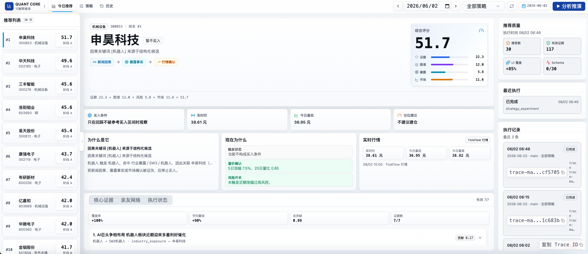

# 股票预测系统

1、第一次同步股票数据可能要很久，因为要从 Tushare 同步所有股票数据。请耐心等待。
2、AI对新闻处理也要很久，因为要处理所有新闻。请耐心等待。



新闻聚合 + 因果关键词网络 + 行情确认 → 可解释股票推荐。

## 技术栈

- **后端**：TypeScript + Bun + Prisma + Vitest
- **前端**：React + Vite + Radix UI + ECharts + AntV G6
- **数据库**：PostgreSQL（含 Apache AGE 图扩展）+ Redis
- **AI**：LangChain + deepagents

## 实现思路

```
抓新闻 → LLM 因果抽取 → 关键词关系图谱 → 行情确认 → 综合评分 → 生成推荐
```

每天跑一次：从新闻里用 LLM 提取因果信号，建关键词关系网，结合 K 线数据打分，选出 30 只推荐股票。

## 需要配置

复制 `.env.example` 为 `.env`。所有 AI 功能只使用一份配置，无需分别配置主模型和廉价模型：

1. 在 `.env` 里填写 `AI_PROVIDER_IDS`（逗号分隔，顺序即优先级）。
2. 每个提供商填写 `AI_PROVIDER_<ID大写>_BASE_URL`、`_API_KEY` 和 `_MODELS`（逗号分隔的模型 id）。至少保留一家供应商、一个模型即可运行。
3. 从仓库根目录启动后端（配置只读根目录 `.env`）。修改配置后重启相关进程。

配置 `DATABASE_URL` 后，所有 AI 入口共用 PostgreSQL 中的限额和健康状态，按有效响应率、耗时和空闲容量分流。每家供应商初始共享 2 个并发，稳定至少 2 分钟且成功 10 次后逐步增加，默认最高 5；全局最高 10。多个模型共享供应商额度。遇到 429 并发减半并冷却，网络连续失败时熔断，恢复阶段仅放行一个探测请求。配置顺序只用于初始同等条件下的排序。

先运行 `cd backend && bunx prisma migrate deploy` 创建 AI 调度表。没有数据库的显式单模型调用仅用于隔离测试；生产入口需要数据库，不能用进程内限流替代共享限额。

只要求供应商支持 Chat Completions；无需安装 CPA。`baseUrl` 填接口前缀，例如 `https://example.com/v1`，程序追加 `/chat/completions`。模型 ID 按供应商要求原样填写，同一模型可出现在不同供应商下。

模型可选参数示例（`AI_PROVIDER_<ID大写>_MODEL_<序号>_*`，序号对应 MODELS 列表顺序）：

```sh
AI_PROVIDER_DEEPSEEK_OFFICIAL_MODEL_1_STREAM=true
AI_PROVIDER_DEEPSEEK_OFFICIAL_MODEL_1_REASONING_EFFORT=high
AI_PROVIDER_DEEPSEEK_OFFICIAL_MODEL_1_RESPONSE_FORMAT=json_object  # 不支持时填 null
AI_PROVIDER_DEEPSEEK_OFFICIAL_MODEL_1_MAX_COMPLETION_TOKENS=8192   # 与 MAX_TOKENS 二选一
AI_PROVIDER_DEEPSEEK_OFFICIAL_MODEL_1_FIRST_RESPONSE_MS=45000
AI_PROVIDER_DEEPSEEK_OFFICIAL_MODEL_1_IDLE_MS=45000
AI_PROVIDER_DEEPSEEK_OFFICIAL_MODEL_1_TOTAL_MS=180000
AI_PROVIDER_DEEPSEEK_OFFICIAL_MODEL_1_CONTEXT_TOKENS=128000
```

仅填写供应商支持的参数。默认使用非流式、`response_format: {"type":"json_object"}`；不支持该参数时设为 `null`，仍会严格校验返回 JSON。设置 `reasoning_effort` 时默认不发送温度；可显式配置 `temperature`，设为 `null` 则不发送。输出长度使用 `max_tokens` 或 `max_completion_tokens`，二选一。自适应调用默认首响应 45 秒、流式无进展 45 秒、总耗时 180 秒，分别由模型 `FIRST_RESPONSE_MS/IDLE_MS/TOTAL_MS` 覆盖；`TIMEOUT_MS` 为总超时兼容字段。心跳不重置无进展计时，正文和推理增量会重置。

请求提示词和完整请求体不得超过 240000 字符。新闻从每批 3 条开始，稳定完成后最多合并为 5 条；长度超限、截断或重复结构错误会拆批，最小一条，单条仍不合法时需要处理。限流不会触发拆批。结构合法但证据不合格的结果仍按原有业务规则拒绝，不通过换模型绕过证据门槛。

供应商和模型的限流字段为 `INITIAL_CONCURRENCY/MAX_CONCURRENCY/RPM/TPM/DAILY_REQUESTS/DAILY_TOKENS/MIN_SPACING_MS/CONTEXT_TOKENS`（提供商级直接加前缀，模型级加 `MODEL_<序号>_` 中缀）。仅填写已知的硬上限；RPM/TPM 响应头用于保守学习，Token 预估使用请求 UTF-8 字节数加输出预算，有实际 usage 时对账，预估不等于服务端计费量。每日额度按 UTC 零点重置。多个入口共用额度时，用 `AI_QUOTA_GROUPS=account` 定义组、`AI_QUOTA_GROUP_ACCOUNT_MAX_CONCURRENCY=2` 配额，并给这些供应商设置 `AI_PROVIDER_<ID大写>_QUOTA_GROUP=account`。

429 优先遵守 `Retry-After`；401、明确余额耗尽或模型不存在会停用对应凭证或模型。未知原因的 403 冷却 15 分钟后再试。配置变更和凭证轮换后重启进程；凭证不写入任务或调用日志。

本项目当前配置的模型统一声明 `limits.contextTokens: 128000`，按用户提供的容量设定，指输入与输出合计的上下文预算。调度器在输入预估之外预留 `max_completion_tokens/max_tokens`，未指定时预留 4096 tokens；不把上下文容量直接当作最大输出长度。项目 240000 字符请求上限仍独立生效。修改此字段不会自动突破 `initialBatchSize/maxBatchSize` 的条数限制，配置重启或续跑后生效。

### AI 断点续跑

```bash
cd backend
bun scripts/run-daily-recommendation.ts --as-of 2026-09-07T16:00:00+08:00
bun scripts/run-daily-recommendation.ts --resume-trace-id <原 traceId>
```

AI 阶段保存完整输入和继续流水线所需的检查点。恢复时沿用原始新闻与 `asOf`，不重新抓新闻，也不重新请求已完成任务（包括合法空结果）。并发、超时和供应商顺序的调整不会清掉完成记录；输入或工作流版本变化需要新 trace。旧版非持久化任务不能直接用新续跑入口恢复。

每轮默认最多一小时，到期标记 `PAUSED`；任务预算耗尽、所有候选永久不可用等情况标记 `NEEDS_ATTENTION`。每个原任务及拆分子任务共享 24 次外部请求预算，续跑不重置。暂停后不会自动另开一轮。所有 AI 任务成功后才执行原推荐流程；已经进入下游或完成的 trace 不允许通过续跑入口重复发布。任务结果和因果候选事务提交，崩溃可能导致外部重复计费，但不会依靠重复写入生成额外候选。

运行状态见 `AiWorkflow/AiWorkItem/AiAttempt`；所有请求共用 `AiSchedulerState` 中的原子并发租约和健康状态。真实数据库集成测试通过 `AI_TEST_DATABASE_URL` 显式启用，测试只创建并删除独立临时 schema。

迁移旧配置：将原 `LLM_SMART_BASE_URL/API_KEY/MODEL` 的值分别填入供应商的 `baseUrl/apiKey/models[0].id`；其他供应商追加到数组。若之前使用 `OPENAI_*` 或 `AI_*` 配置，也按相同方式迁移。旧环境变量及各功能专用模型变量不再控制 AI 调用；原推理、流式和输出长度设置迁入对应模型的 `parameters`。保留 `CAUSAL_SIGNAL_EXTRACTOR=llm`；每日推荐 AI 批次和并发改由 `scheduling` 控制。

真实密钥只放在被 Git 和 Docker 构建忽略的 `backend/tmp/` 中，勿写入示例文件。溯源记录使用实际成功的供应商和模型；不会重写历史推荐。

其他配置按需修改。

## Docker 一键运行

```bash
# 启动所有服务（数据库 + 后端 API + 前端 + 定时任务）
docker compose up -d

# 停止
docker compose down
```

启动后：前端 `http://localhost:3000`，后端 API `http://localhost:8000`。

## 本地开发

```bash
# 1. 启动数据库
docker compose up -d postgres redis

# 2. 安装依赖
make install-dev

# 3. 初始化数据库表
make migrate

# 4. 启动服务
make backend-http   # 后端
make web            # 前端
```
